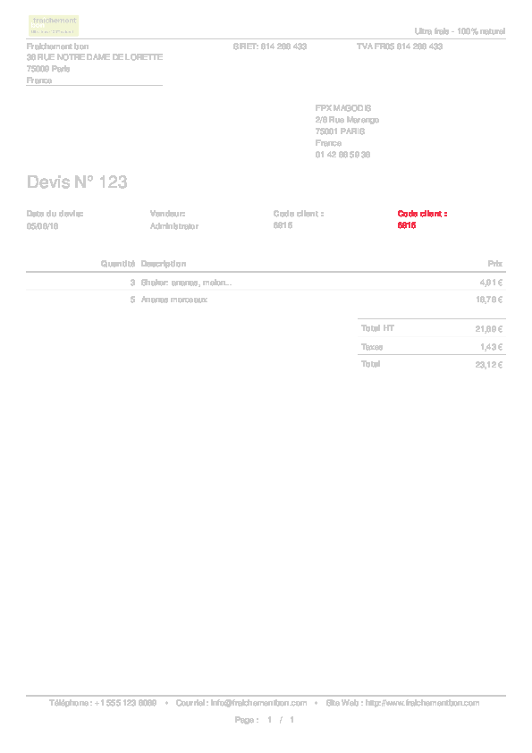

name: tmpl-inverse
layout: true
class: center, middle, inverse

.footnote[
  [Accueil](#cover) -
  Pierre Verkest - [@petrusv84](http://twitter.com/petrusv84) -
  [fork this prez](https://github.com/petrus-v/assert-odoo-report-prez)
]

---
name: cover
template: tmpl-inverse

# Asserting Odoo reports
[presentation]

.headnote[
  P: presenter mode -
  C: clone mode
]

???

préparer la démo:

* Prepare and test commands to run in demo
* cleanup result directory

---
name: summarise
template: tmpl-inverse
class: center, top

# Summarise

### [Introduction](#intro)
### [Démo](#demo)
### [Requirements](#requirements)

???

Present myself and the ligthning talk!

---
name: intro
layout: false

.left-column[
  ## Intro
]
.right-column[

## How do you develop report in odoo?

## Do you automate report testing?

]

???

* What this presentation is about? 
    
    * How to develop reports efficiently
    * How to unit test reports

* How do you developed reports in odoo?

    1. Edit your report
    2. Update your module and start odoo
    3. connect in the web browser
    4. export report / or use the html version
    5. find what are impacts of the chage

---

name: demo

.left-column[
  ## Intro
  ## Démo
]
.right-column[

## How it works?

]

???

1. Odoo generate the pdf files
2. File is saved on FS (*_generate.pdf*)
3. split reports page per page
4. compare each pages pixel by pixel with an expected report
5. generate diff files `.png` and `.gif` files that allow to focus on
   differences

* cons:

    * Make report predictable (as unit test), date / odreding lines...

* pros:

    * Focus on change while developing
    * Detect changes
    * Test upgrades

---

name: requirements

.left-column[
  ## Intro
  ## Démo
  ## Reqts.
]
.right-column[

## Requirements

* [pdftk](https://www.pdflabs.com/docs/pdftk-man-page/) (GPL)
* [imagemagick](www.imagemagick.org) (Apache 2.0)
* [anybox.testing.openerp](
  https://bitbucket.org/anybox/anybox.testing.openerp/branch/assertReport
  "Assert report") branch *assertReport*
* Qweb:
    * wkhtml2pdf
    * [patch to render report "offline"](
      https://github.com/OCA/OCB/pulls/550 
      "PR to generate Qweb report without server")
* Aeroo:
    * libreoffice server to convert odt/ods -> .pdf
* ... 
* Anything that allow odoo to generate a *pdf* report

]

???

---

name: thanks
template: tmpl-inverse
class: center, top

# Thanks
